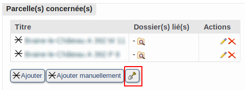
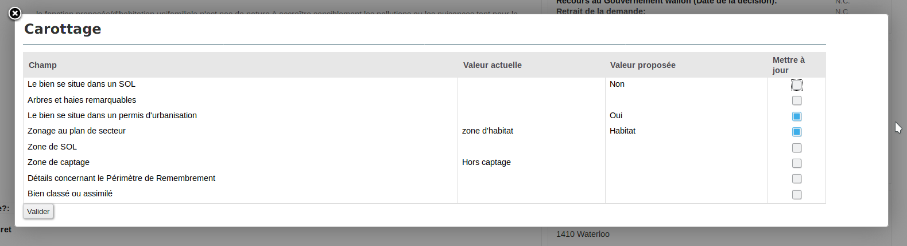
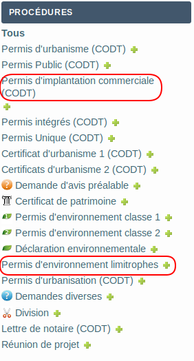
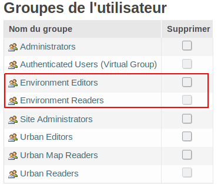
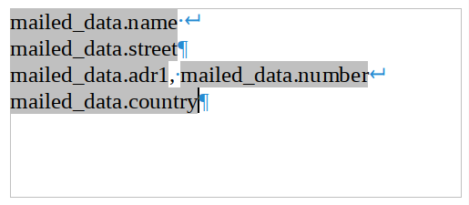
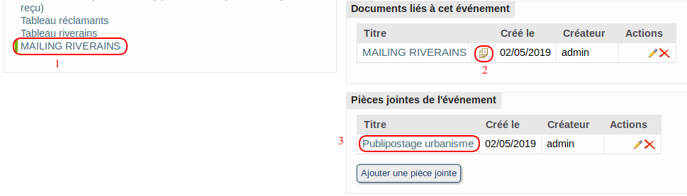
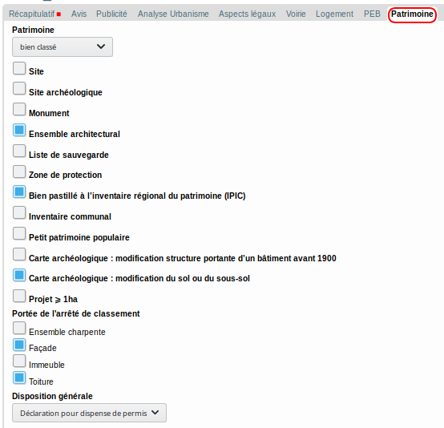
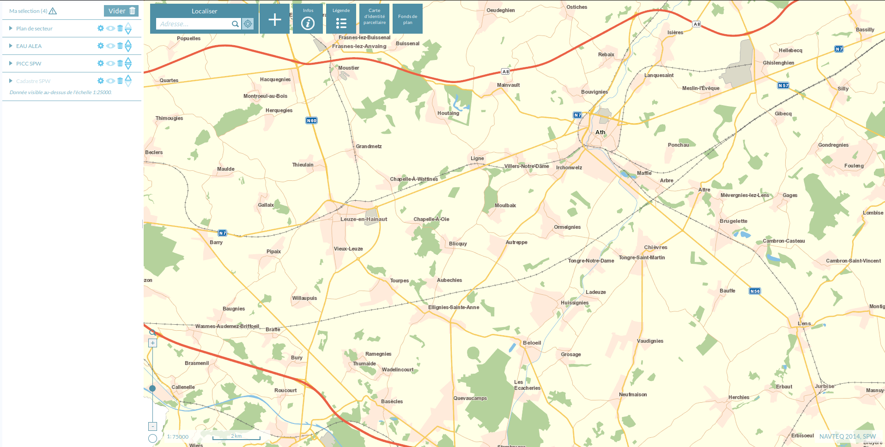

.. Urban documentation master file, created by
   sphinx-quickstart on Tue Mar  6 11:32:14 2018.
   You can adapt this file completely to your liking, but it should at least
   contain the root `toctree` directive.

#########
Versions
#########

Contents:

.. toctree::
   :maxdepth: 2

*********
Urban 2.3
*********

Nouveautés
**********

Carottage
=========

Le carottage permet de récupérer des informations des couches de la Région pour préremplir votre dossier à partir des parcelles encodées.

Les informations concernées par le carottage sont :

* Le bien se situe dans un SOL
* Arbres et haies remarquables
* Le bien se situe dans un permis d'urbanisation
* Zonage de plan de secteur
* Zone de SOL
* Zone de captage
* Détails concernant le Périmètre de Remembrement
* Bien classé ou assimilé

Les informations issues du carottage vous sont proposées à l'ajout avant de les intégrer au dossier

Nouvelles procédures
====================

"Permis d'environnement limitrophes" et "Permis d'implantation commerciale" ont été ajoutées.

Nouveaux groupes d'utilisateurs d'environnement
===============================================

Découplage des autorisations entre urbanisme et environnement : la gestion des permissions est maintenant plus fine à ce niveau.

*********
Urban 2.4
*********

Nouveautés
**********

Gestion du cadastre 2018
========================

À partir des données cadastrales en version 2018, nous vous permettons de rechercher et ajouter des parcelles à jour pour l'année 2018.
La recherche dans l'historique cadastral n'est plus présente, ces données n'étant plus fournies par le cadastre.

La recherche des propriétaires pour une enquête publique reprend maintenant les différents propriétaires possédant un bien à la même adresse de manière indépendante : une ligne par propriétaire.

Publipostage sans extension
===========================

L'extension pour LibreOffice n'est plus nécessaire : vous pouvez dorénavant utiliser les dernières versions de `LibreOffice
<https://fr.libreoffice.org//>`_!

Pour cela, il faut procéder en deux temps :

* Adaptez vos modèles utilisant le publipostage

Vous pouvez facilement adapter vos modèles de documents pour prendre en charge cette nouvelle manière de procéder, en indiquant les informations souhaitées dans le "pavé" de destination :

* Utilisez le publipostage

   #. Générez le document, comme avant, permettra de fusionner les champs à partir du modèle (hormis le destinataire).
   #. Ensuite cliquez sur la petite icône multi-page pour appliquer le publipostage
   #. Cela créera une pièce jointe à l'événement reprenant le document généré pour chaque destinataire concerné.

.. warning::
   Le changement de version de LibreOffice nécessite dans certains cas d'adapter la configuration ZopeEdit au niveau du chemin vers LibreOffice  : :ref:`lo-path-issue` .

Décret Patrimoine
=================

Le Code wallon du Patrimoine entrant en vigueur ce 1er juin 2019, un onglet "Patrimoine" a été ajouté aux permis CODT
---------------------------------------------------------------------------------------------------------------------

Nouvelles couches carottables
-----------------------------

.. todo::
   À venir

Nouvelle interface graphique pour la cartographie
=================================================

.. todo::
   Plus de détails à venir

